# 天氣種子

設計動機與目的， 近年來綠色永續議題抬頭，本團隊認為空氣品質是重要的議題，除了裡面有可觀的數據與分析，使用者對環境有好奇感，希望能夠隨時瞭解空氣品質的狀 況，也希望該地點會有對應的空氣品質反饋。
裝置雛形設計本團隊以會呼吸的綠種子為概念進行原型裝置的開發 透過不同的 3D 塑 模工具來描繪開發天氣種子載具的各種形態，並陸續擴充電子裝置或感應器，進 行功能的強化。

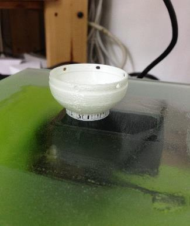
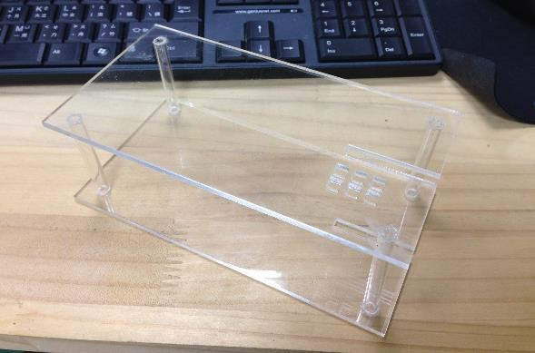
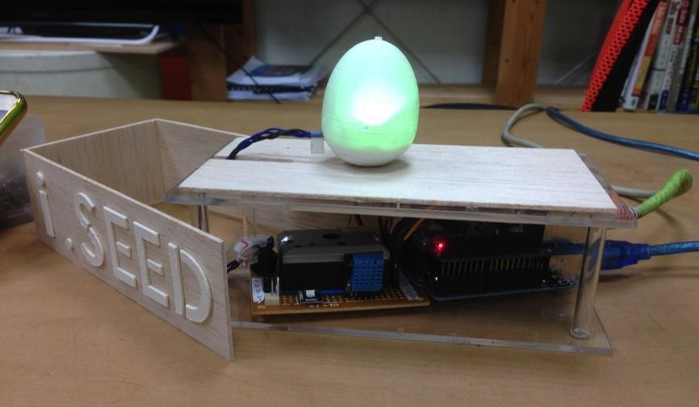

感測元件與控制系統設計，天氣種子裝置採用使用採用 Arduino 作為主要的控制裝置，裝載網路網路模組，搭配各式感測器取得的環境元素，詳細的硬體詳規格如下表:
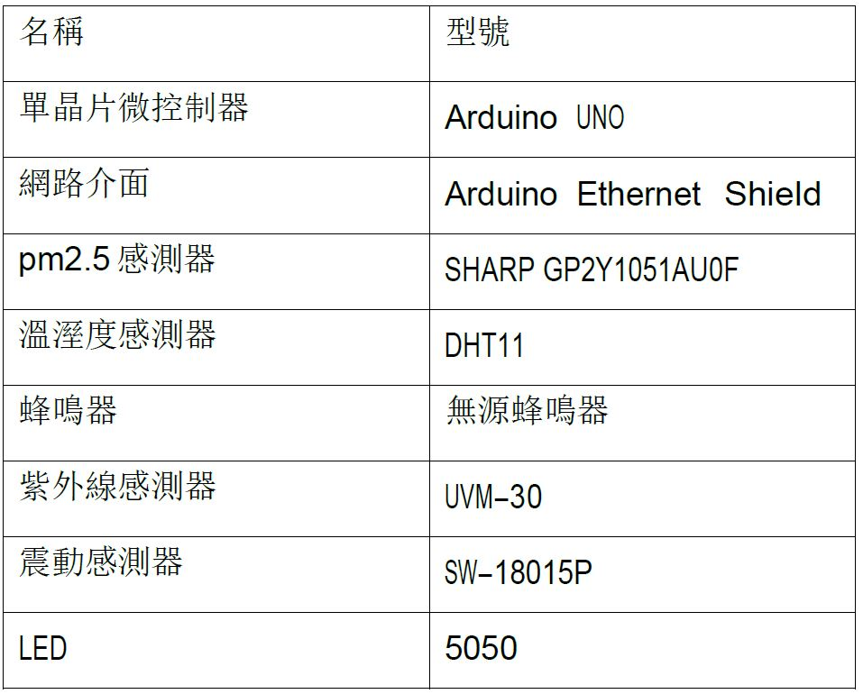
此專案利用 5V 1A 的 USB 接頭為單晶片微控制器以及相關的感測元件提供電力進行運作，另外需搭配 RJ45 網路接頭連至網際網路，其硬體配置如下圖所示。
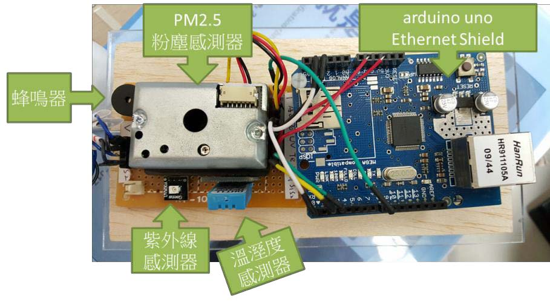
天氣種子平時透過感測器取得”天氣種子” 當下所在的環境元素(如濕度、 溫度、PM2.5)，並依照環境狀況分為 3 個等級，透過天氣種子內部不同的燈光顏色視覺化呈現，讓使用者得知該空間目前的環境品質。
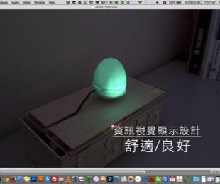
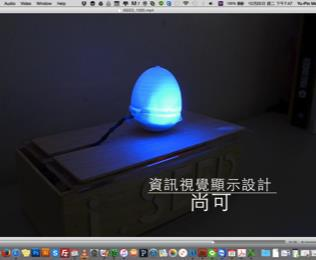
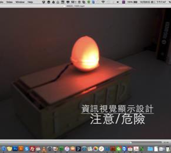
天氣種子在出廠時已配發獨立 ID 並儲存於雲端管理系統中，使得伺服器得 以
管理及事先擷取各個天氣種子所需環境訊息。使用者使用智慧型行動裝置搭載 指
定 APP，隨時憑藉天氣種子 ID 登入雲端伺服器進行相關設定後即可查閱種子 資
訊，而每個天氣種子皆可設定一組外部地區的天氣資訊(例:台北、高雄)，讓 使用
者得以在室內時快速掌握外部天氣資訊。

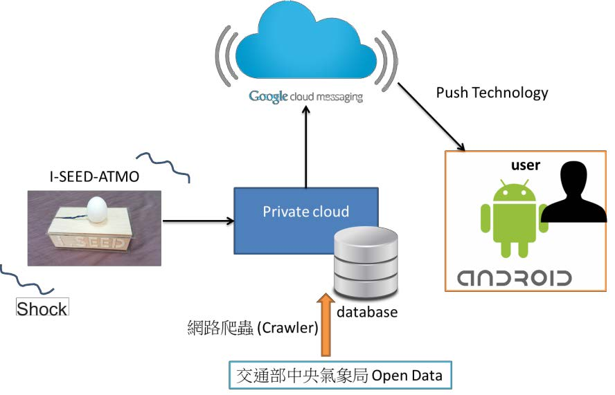
當使用者處於水泥叢林中的室內空間時不易得知外部天氣與空氣品質等環 境
狀況，此時僅需輕撥天氣種子，該裝置將會將本地的環境資訊(包含濕度、溫 度、
PM2.5 等環境元素)傳送至雲端服務中心，雲端服務中心將會結合天氣種子 的環境
元素和事先設定由氣象局取得的其它地區的環境資訊，利用 GCM(Google Cloud
Messaging)推播技術，主動告知使用者，並且呈現詳細的環境資訊(包含 溫度、濕
度、紫外線、PM2.5…等)，同時在天氣種子上顯示外部環境品質，其系 統架構圖
如上。

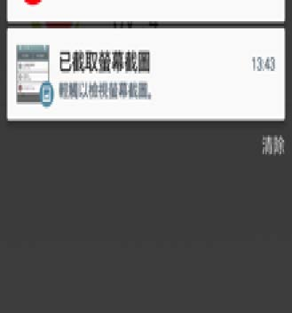
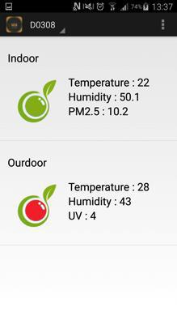
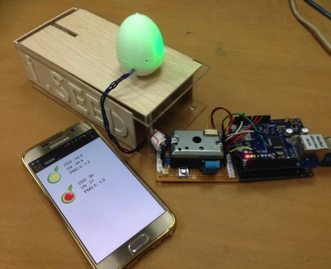
天氣種子載具將呼吸以閃爍頻率來呈現，透過呼吸頻率來隱喻空氣品質的好
壞，取代外界空氣品質警示常用的紅綠燈視覺顯示方式，呼吸緩和表示空氣品質
好，呼吸急促則相反，使用者撥動載具可以啟動螢幕顯示當下空氣品質狀況，提
供更詳細的空氣品質數據及建議。